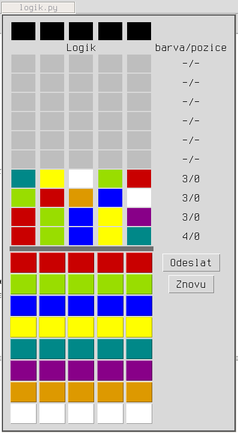

# PRG --  Logik

Implementujte deskovou hru Logik. Hracím kamenům budou odpovídat barvy.

Máme k dispozici
 * 8 druhů hracích kamemů
 * 2 druhy vyhodnocovacích kamenů -- tato informace lze sdělit i textově takže
   je nemusíte používat

Na začátku hry je náhodně rozmístěno 5 různých hracích kamenů. Druh hracího
kamenu se nesmí opakovat. Hráč hádá rozmístění kamenů.

Program při každém pokusu hráči sdělí:

 1. kolik kamenů je použito správně, co do druhu i pozice 
   (černé vyhodnocovací kameny)
 2. kolik kamenů je správného druhu, ale na nesprávné pozici (bílé 
    vyhodnocovací kameny) Toto sdělení může být číslovkou nebo pomocí
    vyhodnocovacího kamene

Hráč má 10 pokusů na to, aby uhodl skrytou kombinaci. Po uhodnutí nebo po
vyčerpání všech pokusů program ukáže zadanou kombinaci.

* <https://mamut.spseol.cz/nozka/python/priklad_logik/>
